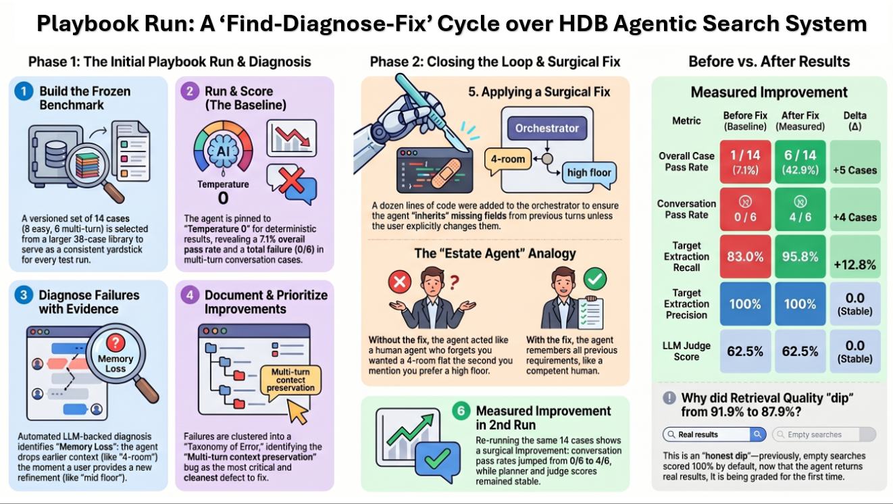
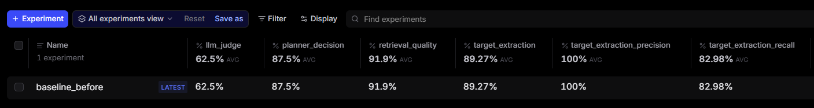
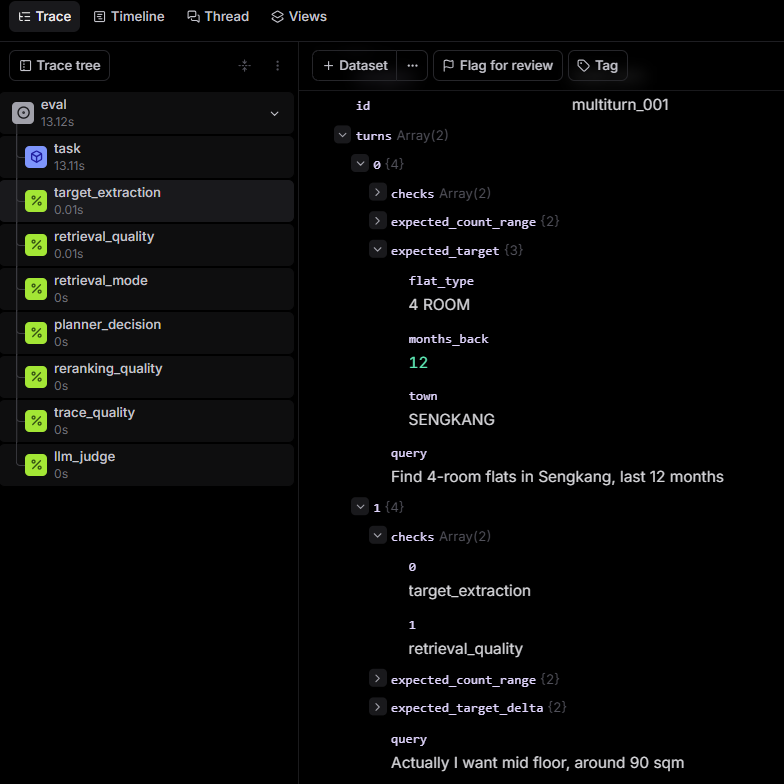
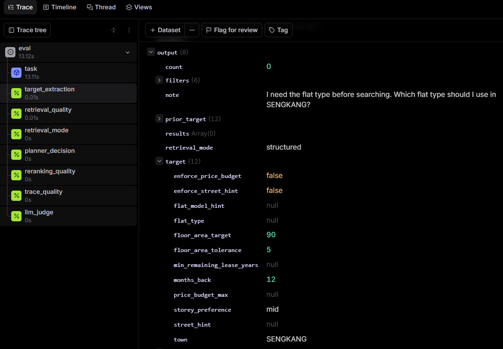
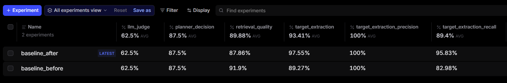

# HDB Agent Evaluation — Playbook Run Report

**What this is.** A single, end-to-end run of the evaluation playbook against the
HDB agentic search system — captured step by step, with the real
artifacts each step produced.

**Why it matters.** It demonstrates a repeatable, measurable loop: build a versioned
benchmark → run & score → diagnose failures with evidence → document → apply a fix and
prove the before/after improvement.

> For full conceptual explanation of each step, see [`README.md`](README.md).



---

## At a glance

| | Detail |
|---|---|
| Benchmark size | 38 cases across 8 categories (this run uses a frozen **14-case subset** — `easy` + `multi_turn`) |
| Scorers | 13 deterministic + 1 LLM-as-judge |
| Experiments | `baseline_before` → (apply one fix) → `baseline_after` |
| Headline result | conversation cases **0/6 → 4/6**, overall pass rate **1/14 → 6/14** — and planner/judge scores unchanged (surgical fix) |

---

## Step 1 — Build the benchmark

**Goal.** Produce a fixed, versioned set of test cases so every run is graded against the
same yardstick. (A fixed dataset is necessary but not sufficient — consistent grading also
needs deterministic model decoding; see Step 2.)

**Command(s) run.**
```bash
python evals/playbook/prepare_benchmark.py
python evals/playbook/seed_dataset.py
```

**Artifacts.**
- Dataset: [`evals/datasets/hdb_compare_benchmark.yaml`](evals/datasets/hdb_compare_benchmark.yaml)

**What the benchmark covers.** The full benchmark is **38 cases across 8 categories**:

<a id="benchmark-categories" name="benchmark-categories"></a>

| Category | What it tests | Cases | In this run |
|---|---|---:|:---:|
| `easy` | happy path — accept in ≤ 2 planner steps | 8 | ✓ |
| `sparse` | under-count — must relax | 5 | |
| `broad` | over-count — must tighten | 4 | |
| `street_hint` | must trigger hybrid retrieval | 5 | |
| `ambiguous` | missing field — must clarify | 4 | |
| `edge` | invalid town / contradictory constraints | 3 | |
| `multi_turn` | context retention across 2 turns | 6 | ✓ |
| `fallback_stress` | exercises the deterministic fallback path | 3 | |
| **Total** | | **38** | **14 selected** |

**Scope of this run — a 14-case subset.** This walkthrough runs a **14-case slice of the same 38-case benchmark**: all 8 `easy`
(happy-path) cases plus all 6 `multi_turn` cases. The dataset file is unchanged — the run is
narrowed at the command line via `--subset` . Every later step (run, diagnose, document, fix) operates on this
same frozen 14-case set.

```bash
# The exact subset passed to every run.py invocation below:
SUBSET="easy_001,easy_002,easy_003,easy_004,easy_005,easy_006,easy_007,easy_008,\
multiturn_001,multiturn_002,multiturn_003,multiturn_004,multiturn_005,multiturn_006"
```

---

## Step 2 — Run & score

**Goal.** Feed every case through the agent and score the output with **13 deterministic
scorers + 1 LLM-as-judge**; publish a named Braintrust experiment plus local reports.

**Determinism first (the Step-1 promise).** The agents are pinned to **`temperature=0`** (`target.py` / `planner.py`) for deterministic decoding. This matters:
an earlier run at the model's *default* temperature was unstable — re-running the identical
"before" state produced a completely different failure list. Pinning `temperature=0` removes
that sampling noise, so the before/after delta is attributable to the fix rather than to luck.

**Command run.**
```bash
# SUBSET is defined in Step 1
PYTHONPATH=. python evals/playbook/run.py --experiment-name baseline_before --subset "$SUBSET"
```

**Artifacts.**
- Scores summary: [`evals/reports/baseline_before_summary.md`](evals/reports/baseline_before_summary.md)
- Failure report: [`evals/reports/baseline_before_failures.json`](evals/reports/baseline_before_failures.json)

**Baseline scores (per scorer, averaged over the 14 cases).**

| Scorer | Score | Notes |
|---|---:|---|
| `target_extraction_precision` | **100%** | every field the agent *did* extract was correct — no corruption |
| `target_extraction` | 89.3% | |
| `target_extraction_recall` | 83.0% | pulled down by multi-turn cases that drop earlier fields |
| `retrieval_quality` | 91.9% | |
| `planner_decision` | 87.5% | |
| `planner_final_action` | 87.5% | |
| `planner_fallback_correct` | 100% | |
| `planner_adjustment_compliance` | 100% | |
| `reranking_quality` | 100% | |
| `trace_quality` / `trace_*` (4) | 100% | trace structure is sound |
| `retrieval_mode` | n/a | not exercised by `easy`/`multi_turn` (it checks `street_hint` cases) |
| `llm_judge` | 62.5% | |
| **Overall case pass rate** | **1 / 14 (7.1%)** | `easy` 1/8 · `multi_turn` **0/6** |

**What the scores say.** The agent's *extraction is clean* (precision
100%) and its *machinery is sound* (trace and reranking at 100%). The damage is concentrated:
**every multi-turn case fails (0/6)** because, in a back-and-forth conversation, the agent
*forgets what you already told it* — when you refine your request, it drops the flat type and
town you gave a moment earlier. That single behaviour drags down recall and the overall pass
rate. Step 3 confirms it with evidence.



---

## Step 3 — Diagnose failures

**Goal.** Turn a wall of low scores into a ranked, evidence-backed work list. This runs
inside `run.py` — one LLM call diagnoses each failing case and records its
failed checks, the likely cause, and a recommended fix.

**Artifacts.**
- Per-case diagnoses: [`evals/reports/baseline_before_failures.json`](evals/reports/baseline_before_failures.json)

**Failure caught in the act.** Every conversation case fails the same way.
Take `multiturn_001` — a two-message chat:



The user says *"Find **4-room** flats in Sengkang"*, then refines: *"Actually I want mid
floor, around 90 sqm."* Here's what the agent produced:



Look at the output: `town: SENGKANG`, `floor_area_target: 90`, `storey_preference: mid`,
`months_back: 12` all carried over correctly — **but `flat_type: null`**. The flat type the
user gave one message earlier was dropped, so `count: 0` and the agent asks for it again:
*"I need the flat type before searching. Which flat type should I use in SENGKANG?"* — the
clearest sign that **the agent forgot what it had just been told.**

The harness's own one-line diagnosis matches exactly:

> **`multiturn_001`** — *"Agent failed to preserve `flat_type` from Turn 1, setting it to
> null in Turn 2 instead of inheriting '4 ROOM', causing the retrieval to fail with count 0."*
> **Recommended fix:** *"…ensure `flat_type` is inherited from previous context when not
> explicitly mentioned in the current turn."*

**Sample of the diagnoses**

| Case | What failed | In plain terms | Recommended fix |
|---|---|---|---|
| `multiturn_001` | `target_extraction`, recall | Forgot the flat type from the earlier message → 0 results | Carry earlier details into the follow-up |
| `easy_004` | `retrieval_quality`, `llm_judge` | Dropped the user's "high floor" request to get more results | Don't relax constraints the user stated explicitly |
| `easy_007` | extraction + planner + judge | Didn't recognise "Executive" as a flat type → asked to clarify instead of searching | Teach it "Executive" is a valid flat type |

The conversation-memory failure (`multiturn_001`) is the **biggest and most consistent** — it
hits all 6 chat cases — so it's the one we fix next (Step 4 → "Applying a fix").

---

## Step 4 — Document how to improve

**Goal.** Synthesise the per-case diagnoses (Step 3) into a short list of failure *modes* —
grouped by the agent component at fault, each with a root cause and a recommended fix — so the
work is a prioritised backlog.

**Command run.**
```bash
python evals/playbook/gen_failure_taxonomy.py
```
This globs the run's `*_failures.json`, derives which components actually have failures, then
asks the judge LLM (at `temperature=0`, deterministic) to cluster the failures by
component and name a root cause + mitigation for each. Its output corroborates the "Top
Failure Modes" already embedded in the run summary.

**Artifacts.**
- Generated taxonomy: [`evals/reports/failure_taxonomy.md`](evals/reports/failure_taxonomy.md)
- (Also embedded in [`evals/reports/baseline_before_summary.md`](evals/reports/baseline_before_summary.md) — *Top Failure Modes*)

**Failure modes found (by component)**

| Component | Failure mode | In plain terms | Test case where supporting evidence was found |
|---|---|---|---|
| **Target Agent** | Multi-turn context preservation | Forgets earlier details on a follow-up — drops the flat type → 0 results | `multiturn_001` — and all 6 [back-and-forth chat tests in multi_turn category](#benchmark-categories) fail this way |
| **Target Agent** | Flat-type extraction | Doesn't recognise "Executive" as a flat type → null | `easy_007` |
| **Planner Agent** | Clarify on incomplete target | Asks the user to clarify when a field is missing (a knock-on of the extraction miss) | `easy_007` |
| **retrieval** | Time-window relaxation | Widens the user's explicit window (9 → 12 months) to get more results | `easy_001` |
| **retrieval** | Storey relaxation | Drops the user's "high floor" preference to hit a result count | `easy_004` |
| **retrieval** | Trace count mismatch | Reported count (111) ≠ results actually returned (30) | `easy_006` |

**The decision.** The **Target Agent → multi-turn** mode is both the **largest** (it breaks
all 6 of the back-and-forth chat tests) and the **cleanest to fix** — the taxonomy's own
mitigation is *"preserve existing fields when merging with new-turn constraints,"* a
deterministic code change, no model retraining or prompt adjustments. 
So that's the selected failure mode we carry into the fix step below; the rest
stay in the backlog for later iterations — which is the point of a taxonomy that's
re-generated on every run.

---

## Applying a fix — measured improvement

This closes the loop. The fix isn't picked at random — the Step-4 diagnosis pointed straight
at it. We apply it, then re-run the **same 14 cases** (same `temperature=0`, same everything
else) so the score change is purely down to the fix.

### From diagnosis to fix

| | In plain terms |
|---|---|
| **The problem** | In a back-and-forth conversation, the agent *forgets what you already told it.* |
| **What you'd see** | You say "4-room in Sengkang," then "actually, mid floor, ~90 sqm" — and it loses the "4-room" part and returns **nothing**. |
| **Why** | On a follow-up, the agent re-reads only your latest message and drops the flat type you gave earlier. |
| **The fix** | Make it **remember and reuse** the details already given, instead of starting over each time. |
| **Evidence** | All 6 conversation cases (`multiturn_001`–`006`) failed this exact way: flat type came back empty → 0 results. |

> **Analogy:** like an estate agent who, the moment you say *"actually, a higher floor,"*
> forgets you wanted a 4-room in Sengkang and asks you to repeat everything. The fix makes
> them keep notes.

**The fix applied.** A small, deterministic change in the agent (`orchestrator.py`): when a
follow-up turn leaves a field blank, the agent now **inherits it from the previous turn**
instead of dropping it. The user's new words always win; the earlier details only fill the
gaps.

The whole fix is this gap-filling merge — about a dozen lines in
`hdb_search_agents/agent/orchestrator.py`:

```python
# After extracting this turn's Target, fill any field the follow-up left
# blank with the value the user gave on a previous turn.
if prior_target is not None:
    target = _merge_with_prior_target(target, prior_target)


def _merge_with_prior_target(target: Target, prior: Target | dict) -> Target:
    """Inherit prior-turn fields the current turn left empty; the current turn always wins."""
    prior_data = prior.model_dump() if isinstance(prior, Target) else prior
    updates = {}
    for field in _MULTITURN_INHERIT_FIELDS:           # town, flat_type, floor_area, storey, …
        current = getattr(target, field, None)
        if (current is None or current == "") and prior_data.get(field) not in (None, ""):
            updates[field] = prior_data.get(field)    # ← reuse the earlier value
    return target.model_copy(update=updates)
```

In plain terms: for each detail worth remembering (town, flat type, size, floor…), if this
turn didn't mention it but an earlier turn did, **carry the earlier value forward**. If the
user *did* state it this turn, that always takes precedence.

### Re-run on the same frozen dataset

Only the multi-turn inheritance changed; the dataset, scorers, model, temperature, and
prompts are identical — so the entire delta is attributable to the fix.

| | Experiment name | Report |
|---|---|---|
| Before fix | `baseline_before` | [`baseline_before_summary.md`](evals/reports/baseline_before_summary.md) |
| After fix | `baseline_after` | [`baseline_after_summary.md`](evals/reports/baseline_after_summary.md) |

### Before vs after (same 14 cases, only this fix changed)

| Scorer | Before (`baseline_before`) | After (`baseline_after`) | Δ |
|---|---:|---:|---:|
| Conversation cases passing (`multi_turn`) | **0 / 6** | **4 / 6** | **+4** |
| `target_extraction` | 89.3% | 97.6% | **+8.3** |
| `target_extraction_recall` | 83.0% | 95.8% | **+12.8** |
| `retrieval_quality` | 91.9% | 87.9% | −4.0 |
| **Overall pass rate** | 1 / 14 (7.1%) | **6 / 14 (42.9%)** | **+5 cases** |

> _The fix is **target-side only**, and the scores prove it's surgical: `planner_decision`
> (87.5% → 87.5%), `planner_final_action` (87.5% → 87.5%) and `llm_judge` (62.5% → 62.5%) are
> **unchanged** — they aren't even scored on the conversation cases — and
> `target_extraction_precision` holds at 100%._
>
> _Why did `retrieval_quality` **dip** ~4 points? Because it became **honest**, not worse.
> This score asks: "of the flats it showed you, how many actually match what you asked for?"
> A search that shows **nothing** gets a perfect score by default — like a student who hands
> in a **blank exam**: nothing there to mark wrong, so 100%. Before the fix, all 6
> conversation searches came back empty, so they each scored a fake 100% that padded the
> average. After the fix they return **real flats**, so they finally get graded for real — and
> a couple aren't perfect yet. An honest 87.9% beats a hollow 91.9%._

**Why 4/6 and not 6/6 — the honest read.** The two still-failing conversation cases fail for
*different, already-catalogued* reasons, **not** the memory bug:
- `multiturn_005` — turn 1 never extracted the flat type in the first place (the "Executive"
  miss, backlog item #4), so there was nothing for the merge to carry forward.
- `multiturn_003` — the flat type **is** now preserved (it returns 39 results, not 0); it fails
  only on `retrieval_quality`, the separate planner-relaxation issue (backlog item #2).

In other words, the merge fixed **exactly** what it was meant to — every case where an
earlier-turn field was dropped — and nothing it wasn't.



_Both rows in one view: `target_extraction` 89.27% → 97.55% and recall 82.98% → 95.83% climb,
while `planner_decision` (87.5%) and `llm_judge` (62.5%) sit unchanged on both rows — the fix
touched only what it should._

### Takeaway

The harness pinpointed a single behaviour — the agent forgetting earlier details in a
conversation — the diagnosis named the fix, and the re-run on the same frozen cases quantified
it: **conversation cases went 0/6 → 4/6 and the overall pass rate 1/14 → 6/14 (+5 cases)**,
while the planner and judge scores stayed flat — proof the fix was surgical, not a broad
sweep. One small, deterministic change, fully attributable to the fix. A closed,
evidence-driven loop: **find → diagnose → fix → prove.**
