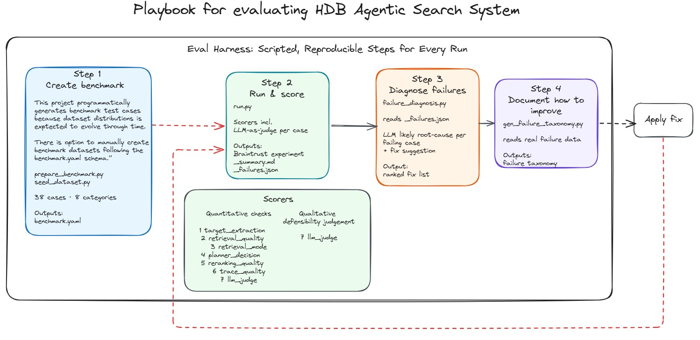
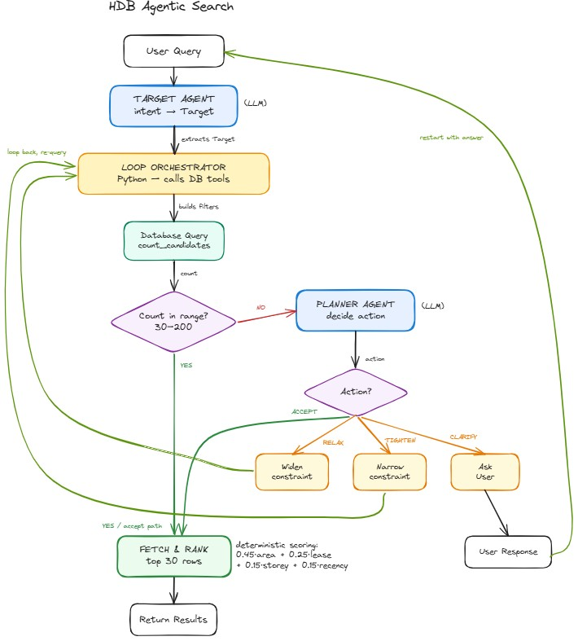

# Playbook for evaluating HDB Agentic Search System

This document explains *how* the agentic system within this repository is evaluated: the
end-to-end workflow, what is being measured, how failures are diagnosed.

The **eval harness** — i.e. the [`evals/`](evals/) folder, and what *"the harness"* refers to
everywhere in this document — is the product on display; the HDB agentic search system
([`hdb_search_agents/`](hdb_search_agents/)) is the system under test.

> ### 👉 See the playbook in action: **[`PLAYBOOK_RUN.md`](PLAYBOOK_RUN.md)**
>
> This README explains the *method*. [**`PLAYBOOK_RUN.md`**](PLAYBOOK_RUN.md) is the
> *worked example*: one real end-to-end run, step by step, with the actual scores,
> screenshots, and a measured **before → after** improvement. In short — the harness
> caught a real bug (the agent *forgetting earlier details in a conversation*), the
> diagnosis named the fix, and re-running on the same frozen cases proved it.

# Tech Stack used

| Category | Technology | Role |
|---|---|---|
| **Eval tracking** | [Braintrust](https://www.braintrust.dev/) | Versioned datasets, named experiments, per-scorer before/after comparison |
| **LLM-as-judge** | Braintrust autoevals (`LLMClassifier`) | Rates quality of agentic system response |
| **LLM models** | [OpenRouter](https://openrouter.ai/) (via OpenAI SDK) | Drives failure diagnosis. This project uses z-ai/glm-5, with the flexibility to switch to any other OpenRouter model. |
| **Data validation** | Pydantic | Validates structured LLM output |
| **Benchmark generation** | SQLAlchemy + psycopg2 | Queries DB to generate data-driven test cases |


## High-level evaluation workflow



The playbook is a **scripted, repeatable four-step workflow** — the same idea as a
test suite, but for an agentic system whose output is judged on quality, not just
pass/fail correctness:

- **Step 1 — Build the benchmark.** `prepare_benchmark.py` generates a fixed set
  of test cases (queries with known-good expectations) and `seed_dataset.py`
  uploads them to Braintrust as a *versioned* dataset, so every run is measured
  against exactly the same yardstick.
- **Step 2 — Run & score.** `run.py` feeds each test case through the agent and
  runs **six deterministic scorer families** (expanded into 13 sub-metrics in the
  Braintrust reports) **plus one LLM-as-judge** over the output. The
  run becomes a named Braintrust *experiment*, and two report files are written:
  a `_summary.md` (scores) and a `_failures.json` (every case that failed a check).
- **Step 3 — Diagnose failures.** `failure_diagnosis.py` takes each failing case
  and asks an LLM for a root-cause hypothesis plus a recommended fix —
  turning a wall of low scores into a ranked, actionable work list.
- **Step 4 — Document how to improve.** `gen_failure_taxonomy.py` script read real failure data and generate grounded documentation from it.

A fix is then applied to the agent and **Step 2 is re-run** —
  Braintrust compares the new experiment against the old one and surfaces the
  per-scorer before/after delta automatically.


## How the agentic system being evaluated in this project works

The diagram below illustrates how the agentic system evaluated in this project operates:



**HDB agentic aearch system flow:**

1. **Target Agent** (LLM) reads your query once and pulls out structured intent — town, flat type, size, floor, time window.
2. **Loop Orchestrator** (Python, not an LLM) turns that into SQL filters and asks the database how many matches exist.
3. **Decision gate:** is the count in the sweet spot of 30–200?
   - **Yes** → skip straight to Fetch & Rank.
   - **No** → hand the situation to the **Planner Agent** (LLM).
4. **Planner Agent** looks at the count and picks one action:
   - **Relax** → widen constraints (too few results) → loop back.
   - **Tighten** → narrow constraints (too many) → loop back.
   - **Clarify** → ask the user a question, then restart with their answer.
   - **Accept** → good enough → Fetch & Rank.
5. **Fetch & Rank** pulls the rows and a deterministic re-ranker scores the top 30 by area, lease, storey, and recency.

---


## Step 1 — Build the benchmark

### Scope of Evaluation for the Agentic System

The harness treats the agentic system being evaluated as a **black box** — its runner,
[`run.py`](evals/playbook/run.py), sends a natural-language query (from    test cases) in and captures the response:

| Response Field from agentic system | What it tells the evaluator in this project |
|---|---|
| `target` | the structured intent the Target Agent extracted (town, flat_type, floor area, storey, time window) — did the agent *understand the question*? |
| `filters` | the SQL filters the orchestrator derived from the target |
| `count` | how many comparable transactions ended up in the final pool — did it land in the 30–200 sweet spot? |
| `retrieval_mode` | which retrieval strategy was chosen (structured / hybrid) — was it the *right* one for this query? |
| `trace` | the step-by-step record of every planner decision — *why* did the agent do what it did? |
| `results` | the top-30 reranked transactions — are these *defensible comparables* i.e. a good match for the query? |
| `note` | the user-facing summary of any relaxations/tightenings applied |
| `messages` | Target Agent message history, used to drive multi-turn cases |

So across the benchmark we are checking six distinct qualities:

- Did the agent read the query correctly?
- Did it retrieve relevant flats?
- Did it pick the right retrieval mode?
- Did the planner loop make sound decisions?
- Did the reranker order results well?
- Is the trace complete enough to debug?

Plus an overall LLM judgment on whether the comparables are defensible — i.e., a good match for the query.

### The benchmark dataset and how it is generated

The benchmark is the exam paper the agentic system sits: a set of queries, each paired with a known-good expectation the scorers grade against. It lives in
[`evals/datasets/hdb_compare_benchmark.yaml`](evals/datasets/hdb_compare_benchmark.yaml)
(8 categories) and is produced by [`prepare_benchmark.py`](evals/playbook/prepare_benchmark.py).

Each category is designed to stress a *different* part of the agent, so a low score in one group
points straight at the weak component:

| Category | What it tests | Component |
|---|---|---|
| `easy` | happy path — accept in ≤ 2 planner steps | Planner Agent |
| `sparse` | under-count — must relax | Planner Agent |
| `broad` | over-count — must tighten | Planner Agent |
| `street_hint` | must trigger hybrid retrieval | Orchestrator / retrieval |
| `ambiguous` | missing field — must clarify | Planner Agent |
| `edge` | invalid town / contradictory constraints | Retrieval |
| `multi_turn` | context retention across 2 turns | Target Agent |
| `fallback_stress` | exercises the deterministic fallback path | Planner Agent + orchestrator |

**The cases are built two different ways, on purpose.** Half the categories are
*generated from the live database* and half are *hand-written templates baked
into the script* — the split is deliberate and reflects what each category
actually depends on:

- **Data-generated (`easy`, `sparse`, `broad`, `street_hint`).** The script (prepare_benchmark.py)
  queries the DB for transaction counts per town × flat-type combination across multiple time windows, then sorts combos into difficulty buckets by count (30–200 → `easy`; too few → `sparse`; 300+ → `broad`; live street names → `street_hint`).
  These must be regenerated on each data re-ingest, since the expected counts are tied to what is actually in the DB.

- **Hand-written (`ambiguous`, `edge`, `multi_turn`, `fallback_stress`).** These
  test agent *behaviour* that does not depend on data volume — a vague query is
  vague, a contradictory constraint is contradictory, and a two-turn
  conversation tests memory regardless of how many rows exist. They are stored as
  fixed templates in the script and edited by hand only when the intended test
  itself changes, so they stay stable across data refreshes.


## Step 2 — Run & score

### What is evaluated, quantitatively and qualitatively

Scoring has two halves. The **quantitative** half is **six deterministic scorer
families** — which expand into **13 deterministic sub-metrics** in the Braintrust
reports (e.g. `target_extraction` splits into precision and recall; the planner and
trace checks into several sub-scores) — that compare the agent's output against the
test case's declared expectations and return a number in `[0, 1]`; the same input
always yields the same score. The **qualitative** half is a single LLM-as-judge that
reads the results the way a human reviewer would and rates whether they are defensible.

#### The two kinds of grading

When the agent answers a query, there are two *different* kinds of question you
can ask about its output:

1. **"Did it follow the rules I can check mechanically?"** → **quantitative checks**
2. **"Are these actually good comparables a human would accept?"** → **qualitative defensibility judgement**

The first is rule‑based. The second requires judgment — so the harness delegates it to an LLM acting as a stand‑in human reviewer.

```
QUANTITATIVE CHECKS (1–6)              QUALITATIVE JUDGEMENT (7)
deterministic · rule-based             LLM-as-judge · opinion-based
─────────────────────────────         ─────────────────────────────
1  target_extraction                   7  llm_judge
2  retrieval_quality
3  retrieval_mode                      "Are these comparables
4  planner_decision                     defensible for the query?"
5  reranking_quality                    GOOD / PARTIAL / POOR
6  trace_quality                        → 1.0 / 0.5 / 0.0
```

**Scorers 1–6 are quantitative.** Each compares the agent's output against
something *known and exact*, then returns a number — no opinion involved. For
example, `target_extraction` checks whether the agent pulled out exactly
`town = "ANG MO KIO"` (string match); `retrieval_quality`
just counts what fraction of the returned flats sit in the right town / flat type
/ area band / date range (e.g. 27/30 = 0.90). Run them a thousand times and the
score is identical every time — ie. **deterministic**, and it is
why these checks pinpoint *which component* broke.

**Scorer 7 is qualitative.** Some questions can't be reduced to a rule. The agent
might pass every mechanical check — right town, right count, complete trace — and
*still* return flats a human would call "not really comparable." Capturing that
needs judgement, so `llm_judge` shows the query and the results to an LLM and asks
**"are these comparables defensible?"** → GOOD (1.0), PARTIAL (0.5), or POOR
(0.0), with its written reasoning attached.

#### Why this project needs both

| | Quantitative (1–6) | Qualitative (7) |
|---|---|---|
| **Asks** | "Did it obey the spec?" | "Is the result *actually any good*?" |
| **Like grading** | spelling & word-count check | "is the argument convincing?" |
| **How** | code compares to expected values | an LLM reviews and rates |
| **Strength** | exact, repeatable | catches subtle quality issues rules miss |
| **Weakness** | a result can pass every rule yet still be bad | costs an LLM call, slight variability |

The quantitative checks are the **safety net** — fast, free, and they localise
exactly which component failed (target? retrieval? planner?). The qualitative
judgement is the **sanity check** — it catches cases where everything looks
correct on paper but the comparables still wouldn't hold up. Neither alone is
enough: rules miss "feel," and judgement alone can't tell you *where* the pipeline
went wrong. Using both is what makes the eval trustworthy.

**All scorers are custom-built** — [`evals/scorers/`](evals/scorers/), not provided by Braintrust. Braintrust is used only as the experiment-tracking platform (storing runs, surfacing per-scorer deltas, comparing experiments). The exception is `llm_judge`, which uses Braintrust's `autoevals.LLMClassifier` helper — but the prompt, and grading rubric are defined in this project.

Each scorer receives `(input, output)` and returns a score in `[0, 1]` (or named sub-scores). All are deterministic except `llm_judge`. See [`evals/scorers/`](evals/scorers/).

| Evaluation area | Metric | Scorer | What it checks |
|---|---|---|---|
| Target extraction | field-level precision/recall | `target_extraction` | Precision/recall/F1 of extracted `Target` vs. expected; string fields exact-match |
| Target carryover | prior-turn fields preserved | `target_extraction` (multi-turn) | updated fields changed and preserved fields unchanged across turns |
| Retrieval relevance | % results matching hard constraints | `retrieval_quality` | fraction of results satisfying town, flat_type, date range, and floor-area band |
| Retrieval mode | correct retrieval mode per query | `retrieval_mode` | verifies right mode chosen; street-hint queries must end in `hybrid` retrieval mode |
| Planner decisions | correct relax/tighten/clarify/accept | `planner_decision` | final action, adjustment appropriateness, and fallback correctness sub-score |
| Planner fallback | fallback fires only when expected | `planner_decision` (sub-score) | `fallback_correct` score: 1.0 if fallback fires iff the case is from category `fallback_stress` |
| Reranking quality | top-N closer to target area than raw pool | `reranking_quality` | top-N reranked results are closer to target floor area than the raw candidate pool |
| Trace quality | trace complete and well-formed | `trace_quality` | every `TraceStep` has action + count; relax/tighten steps carry an adjustment + note |
| Regression | before/after delta per scorer | Braintrust experiments | re-running after a change surfaces per-scorer delta against the prior versioned experiment |
| LLM-as-judge | comparables defensible for the query | `llm_judge` | LLM Judge inspects the returned comparables, labels them GOOD/PARTIAL/POOR (scored 1.0/0.5/0.0), and includes reasoning. |

Every run becomes a named Braintrust experiment, so re-running after an agent change against the same versioned dataset produces a directly comparable before/after view — at Braintrust platform.


## Step 3 — Diagnose failures

### How failures are identified and diagnosed

Identifying a failure is mechanical: any test case where one or more scorers
returned `< 1.0` is a failing case. Turning that into something *actionable* is
the job of [`evals/playbook/failure_diagnosis.py`](evals/playbook/failure_diagnosis.py).

For each failing case, the harness makes **one LLM call** to the judge model (configurable via `JUDGE_OPENROUTER_MODEL_NAME` in .env, allowing any OpenRouter‑supported model) and requests exactly two short, single‑sentence outputs:

- **`likely_cause`** — a root-cause hypothesis that references concrete fields
  (e.g. the extracted town, the final count, a specific trace action).
- **`recommended_fix`** — a targeted next action that names a component (a
  prompt, a scorer, a planner adjustment, a retrieval mode) rather than something
  generic.

A few engineering details make this reliable rather than flaky:
- **Structured output.** Every LLM reply is validated against a Pydantic model (`Diagnosis`), guaranteeing both fields are present and non-empty. The prompt's schema is generated from that same model, so the prompt and parser always stay in sync.
- **Compact input.** Instead of sending the full agent output, it trims everything down to the essentials — target, count, retrieval mode, a simplified trace, and a 5-row sample. Enough to diagnose, without wasting context.
- **Robust parsing.** It cleans up the LLM's reply by stripping code fences, recovering JSON mixed into prose, and falling back to the `reasoning` field when some providers put the answer there instead of `content`. If one reply can't be parsed, it inserts a placeholder and keeps going rather than aborting the run.
- **Cost discipline.** The LLM is only called for failing cases. Passing cases produce no LLM work at all.

All results are written to `evals/reports/<experiment>_failures.json`. Each record contains the test ID, the query, which checks failed, what the agentic system actually returned vs. what was expected, and the LLM's diagnosis. This file is the ranked, evidence-backed fix list that feeds Step 4.


## Step 4 — Document & improve

### Data‑Driven Failure Taxonomy Generation

Documentation about failure taxonomy is generated directly from real evaluation artifacts, to ensure it always reflects what actually happened. The script [`evals/playbook/gen_failure_taxonomy.py`](evals/playbook/gen_failure_taxonomy.py) converts raw failure reports into docs/failure_taxonomy.md using a five‑stage process.

1. **Gather.** Reads every failure report from `evals/reports/` and removes duplicates — if the same failure appeared in multiple runs, it's only counted once, so no single issue looks worse than it really is.
2. **Map to components.** Each failed scorer is assigned to one of four parts of the system — **Target Agent**, **Planner Agent**, **retrieval**, or **reranking**. Only parts that actually have failures appear in the output.
3. **Cluster (one LLM call).** An LLM reads all the root-cause descriptions from Step 3 and groups them into named failure patterns. For each pattern it produces: what it's called, what you'd observe, why it happens, how to fix it, and a direct quote from a real failing test as evidence. The response is validated to ensure every field is present before the output is accepted.
4. **Guarantee coverage.** Two safety checks run after the LLM responds: first, no broken component is left out — if something failed, it must appear in the report. Second, at least one entry must point to a real, specific value from the agent's run (like an actual town name it extracted, or a count it returned) — so the report is always grounded in what really happened, not vague generalizations.
5. **Render deterministically.** The script, not the LLM, writes the final Markdown. The structure is fixed — one section per component, four labelled lines per failure pattern — so the document always looks the same regardless of what the LLM returned.

`gen_failure_taxonomy.py` closes the loop: it turns the evidence from Step 3 into live documentation, a fix is applied, and
**Step 2 can be re-run to measure the before/after improvement**.


---

## Running the playbook — commands

This section gives the actual commands to run the four-step loop end to end. All
commands are run from the repository root. Step 3 (failure diagnosis) is **not** a
separate command — it runs automatically inside `run.py`, which writes both the
`_summary.md` and the `_failures.json` for every run.

### Prerequisites (once per machine)

**First, set up the agentic system under test.** Follow the instructions in
[`hdb_search_agents/README.md`](hdb_search_agents/README.md) to stand up the agentic
system (database, schema, data ingestion, dependencies) before running any evals — the
harness calls the agent, so it must be working first.

```bash
# 1. Start PostgreSQL (pgvector + pg_textsearch); data must already be ingested.
docker compose up -d

# 2. Required keys in .env: OPENROUTER_API_KEY, JINA_API_KEY, BRAINTRUST_API_KEY.
#    JUDGE_OPENROUTER_MODEL_NAME is optional (defaults to z-ai/glm-5).
```

### Step 1 — Build the benchmark

```bash
# Generate the benchmark YAML from the live DB (regenerate after any data re-ingest).
python evals/playbook/prepare_benchmark.py

# Push it to Braintrust as a versioned dataset (re-run whenever the YAML changes).
python evals/playbook/seed_dataset.py
```

### Step 2 — Run & score (Step 3 diagnosis runs inside this)

```bash
# Full run, named experiment. Writes:
#   evals/reports/baseline_summary.md      (scores)
#   evals/reports/baseline_failures.json   (every failing case + LLM diagnosis)
python evals/playbook/run.py --experiment-name baseline

# Faster iteration: run a subset by category or case IDs.
python evals/playbook/run.py --experiment-name baseline --subset easy,ambiguous
python evals/playbook/run.py --experiment-name baseline --subset easy_001,easy_002
```

### Step 4 — Document how to improve

```bash
# Synthesise evals/reports/failure_taxonomy.md from all *_failures.json reports.
python evals/playbook/gen_failure_taxonomy.py
```

### Measuring a before/after improvement

The harness is built so that measuring a fix needs **no harness changes** — only a new
`--experiment-name`. Braintrust compares the two experiments and surfaces the per-scorer
delta automatically.

> 📄 **Worked example:** [`PLAYBOOK_RUN.md`](PLAYBOOK_RUN.md) runs this exact loop with real
> numbers — `baseline_before` → `baseline_after`, a one-function multi-turn fix in
> `hdb_search_agents/agent/orchestrator.py`, conversation cases **0/6 → 4/6**.

```bash
# 1. Baseline run (before the change).
python evals/playbook/run.py --experiment-name baseline_before

# 2. Apply your change to the agent under test — a prompt, a field-merge rule, a
#    retrieval tweak, etc. — keeping the dataset frozen.

# 3. Re-run against the same dataset under a new name (after the change).
python evals/playbook/run.py --experiment-name baseline_after

# 4. Regenerate the taxonomy to show failure modes appearing/disappearing.
python evals/playbook/gen_failure_taxonomy.py
```

> Keep the dataset frozen between the two runs so the entire score delta is attributable
> to the agent change alone — not to a different set of test cases.
